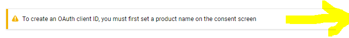

# Catalogue_App_Project 


### Project Description

Develop an application that provides a list of items within a variety of categories as well as
provide a user registration and authentication system. Registered users will have the ability to post, 
edit and delete their own categories and items. 

1. Why This Project?
    Modern web applications perform a variety of functions and provide amazing features and utilities to their
    users; but deep down,   it’s really all just creating, reading, updating and deleting data. In this project, 
    you’ll combine your knowledge of building dynamic websites with persistent data storage to create a web 
    application that provides a compelling service to your users.

2. What Will I Learn?
   You will learn how to develop a RESTful web application using the Python framework Flask along with implementing
   third-party OAuth authentication. You will then learn when to properly use the various HTTP methods available
   to you and how these methods relate to CRUD (create, read, update and delete) operations.


### How to Run?

#### PreRequisites:
  * [Python3](https://www.python.org/)
  * [Vagrant](https://www.vagrantup.com/)
  * [VirtualBox](https://www.virtualbox.org/)
  * [google Oauth Cient](https://console.developers.google.com/)
  
#### Setup Project:
  1. Install Vagrant and VirtualBox
  2. Download or Clone [fullstack-nanodegree-vm](https://github.com/mdjolieca/fullstack-nanodegree-vm) repository.
  
#### Launching the Virtual Machine:
  1. Launch the Vagrant VM inside the Vagrant sub-directory in the downloaded fullstack-nanodegree-vm repository using  this command:
   ```
    $ vagrant up
  ```
  2. Then Log into vagrant:
  ```
    $ vagrant ssh
  ```
  3. Change directories to /vagrant/catalog
  ```
    $ cd /vagrant/catalog
  ```
  4. All of the files related to this project are in the [/vagrant/catalog](https://github.com/mdjolieca/fullstack-nanodegree-vm/tree/master/vagrant/catalog) directory
  
  
#### Setting up the database:

   1. run the /vagrant/catalog/database_setup.py script.
      After execution of this file you will see a catalogue.db file.:
  
    ```
    $ python3 database_setup.py
    ```
  
   2. Load the data into the catalogue database using the populate_db.py script. **Before running this 
   script edit line [16](https://github.com/mdjolieca/fullstack-nanodegree-vm/blob/master/vagrant/catalog/populate_db.py#L16)
   to include the gmail email adress that will be used for testing.** The user name and picture will be 
   updated on first login. 
   ``` 
    $ vi populate_db.py   # besure to update line 16 as mentioned above
    $ python3 populate_db.py
  ```
  
#### Google Oauth Setup:
  1. [GO to Google APIs Console —](https://console.developers.google.com/) and click Select a project.  
   </br>
   
   </br> 
   
   </br>
   
   </br>
   
   </br>
   
   </br>
   
   </br>
   
   </br>
   
   </br>
   
   </br>
   
   
  2. Download the newly created client secret file to /vagrant/catalog home directory and rename it.
      **Rename the file to client_secret.json** . (if you want to use a different file name [edit appliction.py file](https://github.com/mdjolieca/fullstack-nanodegree-vm/blob/master/vagrant/catalog/application.py#L34)
      
  3.  You must also edit the login.html file to include the [client ID](https://github.com/mdjolieca/fullstack-nanodegree-vm/blob/master/vagrant/catalog/templates/login.html#L23) The client_ID can be found in the client_secret.json file. Format
is ****************************.apps.googleusercontent.com .
  
 
#### Run the Catalog App:

  ```
    $ python3 application.py
  ```
  
  **Applicaiton HomePage**   http://localhost:5000/catalog/
